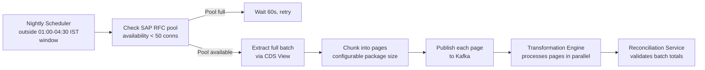

# Data Flow Diagram 2 — Scheduled Batch Extraction Flow

```mermaid
flowchart LR
    A[Nightly Scheduler\n outside 01:00-04:30 IST window] --> B[Check SAP RFC pool\navailability < 50 conns]
    B -->|Pool full| C[Wait 60s, retry]
    B -->|Pool available| D[Extract full batch\nvia CDS View]
    D --> E[Chunk into pages\nconfigurable package size]
    E --> F[Publish each page\nto Kafka]
    F --> G[Transformation Engine\nprocesses pages in parallel]
    G --> H[Reconciliation Service\nvalidates batch totals]
```