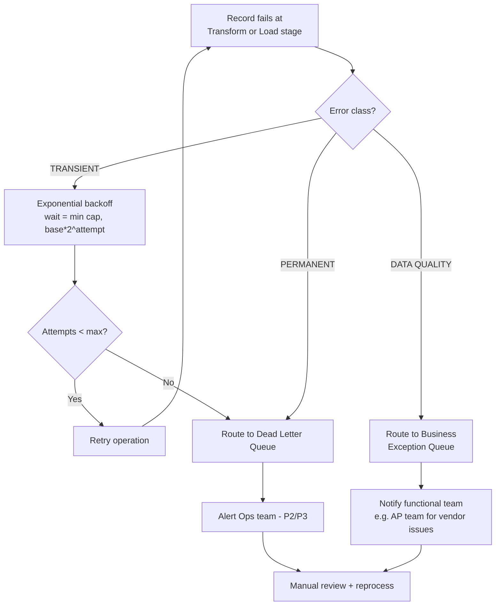

# Data Flow Diagram 3 — Error Handling and Retry Flow

```mermaid
flowchart TD
    A[Record fails at\nTransform or Load stage] --> B{Error class?}
    B -->|TRANSIENT| C[Exponential backoff\nwait = min cap, base*2^attempt]
    C --> D{Attempts < max?}
    D -->|Yes| E[Retry operation]
    E --> A
    D -->|No| F[Route to Dead Letter Queue]
    B -->|PERMANENT| F
    B -->|DATA QUALITY| G[Route to Business\nException Queue]
    F --> H[Alert Ops team - P2/P3]
    G --> I[Notify functional team\ne.g. AP team for vendor issues]
    H --> J[Manual review + reprocess]
    I --> J
```