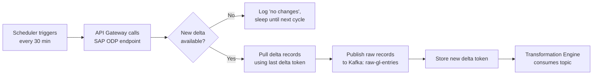

# Data Flow Diagram 1 — Real-Time ODP Delta Flow

```mermaid
flowchart LR
    A[Scheduler triggers\nevery 30 min] --> B[API Gateway calls\nSAP ODP endpoint]
    B --> C{New delta\navailable?}
    C -->|No| D[Log 'no changes',\nsleep until next cycle]
    C -->|Yes| E[Pull delta records\nusing last delta token]
    E --> F[Publish raw records\nto Kafka: raw-gl-entries]
    F --> G[Store new delta token]
    G --> H[Transformation Engine\nconsumes topic]
```