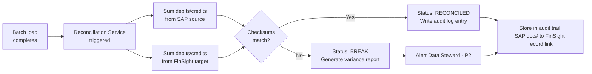

# Data Flow Diagram 4 — Reconciliation and Audit Flow

```mermaid
flowchart LR
    A[Batch load\ncompletes] --> B[Reconciliation Service\ntriggered]
    B --> C[Sum debits/credits\nfrom SAP source]
    B --> D[Sum debits/credits\nfrom FinSight target]
    C --> E{Checksums\nmatch?}
    D --> E
    E -->|Yes| F[Status: RECONCILED\nWrite audit log entry]
    E -->|No| G[Status: BREAK\nGenerate variance report]
    G --> H[Alert Data Steward - P2]
    F --> I[Store in audit trail:\nSAP doc# to FinSight record link]
    H --> I
```