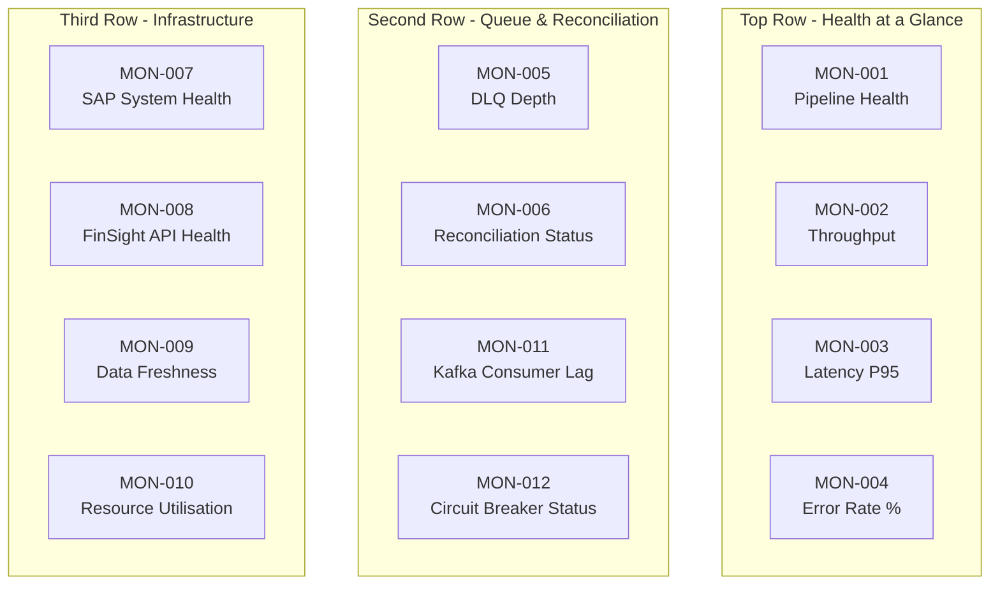

# Monitoring Dashboard Layout Mockup

```mermaid
flowchart TB
    subgraph Row1["Top Row - Health at a Glance"]
        M1[MON-001<br/>Pipeline Health]
        M2[MON-002<br/>Throughput]
        M3[MON-003<br/>Latency P95]
        M4[MON-004<br/>Error Rate %]
    end

    subgraph Row2["Second Row - Queue & Reconciliation"]
        M5[MON-005<br/>DLQ Depth]
        M6[MON-006<br/>Reconciliation Status]
        M11[MON-011<br/>Kafka Consumer Lag]
        M12[MON-012<br/>Circuit Breaker Status]
    end

    subgraph Row3["Third Row - Infrastructure"]
        M7[MON-007<br/>SAP System Health]
        M8[MON-008<br/>FinSight API Health]
        M9[MON-009<br/>Data Freshness]
        M10[MON-010<br/>Resource Utilisation]
    end
```