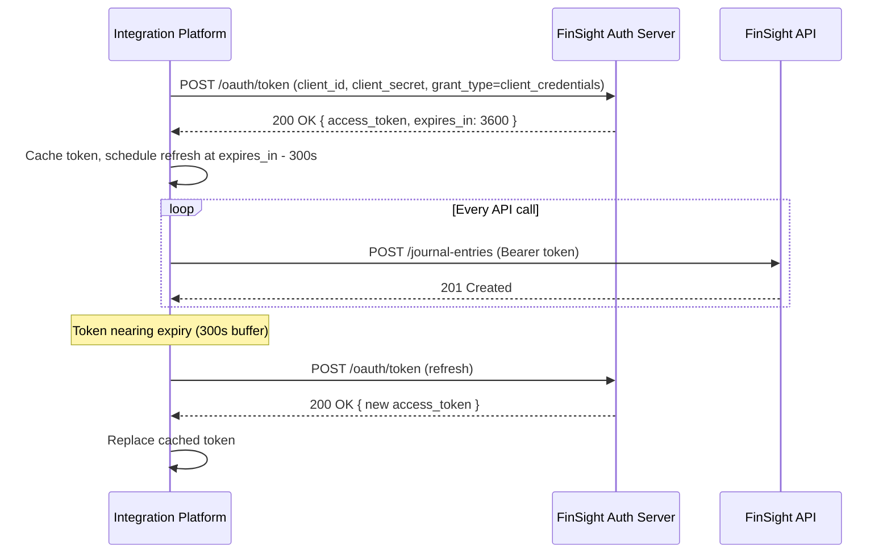

# Sequence Diagram 4 — OAuth 2.0 Client Credentials Flow

```mermaid
sequenceDiagram
    participant TE as Integration Platform
    participant Auth as FinSight Auth Server
    participant FS as FinSight API

    TE->>Auth: POST /oauth/token (client_id, client_secret, grant_type=client_credentials)
    Auth-->>TE: 200 OK { access_token, expires_in: 3600 }
    TE->>TE: Cache token, schedule refresh at expires_in - 300s

    loop Every API call
        TE->>FS: POST /journal-entries (Bearer token)
        FS-->>TE: 201 Created
    end

    Note over TE: Token nearing expiry (300s buffer)
    TE->>Auth: POST /oauth/token (refresh)
    Auth-->>TE: 200 OK { new access_token }
    TE->>TE: Replace cached token
```