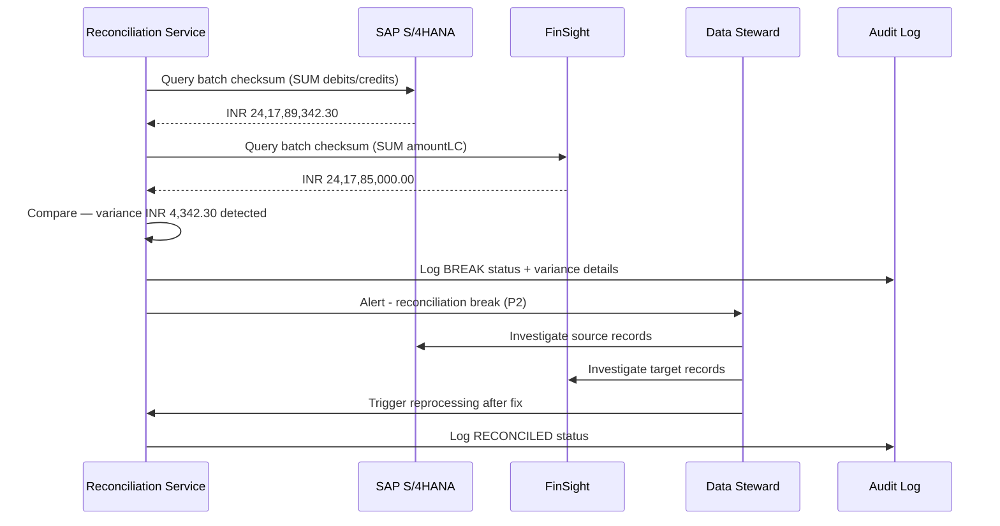

# Sequence Diagram 3 — Reconciliation Mismatch Resolution

```mermaid
sequenceDiagram
    participant RS as Reconciliation Service
    participant SAP as SAP S/4HANA
    participant FS as FinSight
    participant DS as Data Steward
    participant Aud as Audit Log

    RS->>SAP: Query batch checksum (SUM debits/credits)
    SAP-->>RS: INR 24,17,89,342.30
    RS->>FS: Query batch checksum (SUM amountLC)
    FS-->>RS: INR 24,17,85,000.00
    RS->>RS: Compare — variance INR 4,342.30 detected
    RS->>Aud: Log BREAK status + variance details
    RS->>DS: Alert - reconciliation break (P2)
    DS->>SAP: Investigate source records
    DS->>FS: Investigate target records
    DS->>RS: Trigger reprocessing after fix
    RS->>Aud: Log RECONCILED status
```